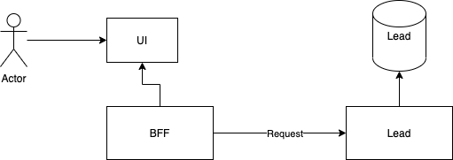

# Solution Description

## Using clean structure

This project have four layer which are application layer, infrastructure layer, domain layer and web layer.

- The domain layer is at the centre and include the domain logic.
- The application layer have business logics and it has dependences with infrastructure and domain.
- The infrascture layer include the code to interact with DB
- The Web layer include restful api and host a react(it will be move to BFF service, and want to make it only work for lead domain)

## Architecture

This project is microservice structure, currenclty this project include UI and back-end code and it will be move the UI to BFF service and the ideal structure is shown below:

